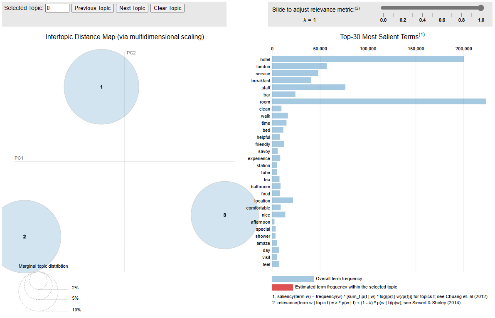

# Topic Modeling {#topicmodeling}

Topic models are generative probabilistic models that identify topics as clusters of words with an associated probability distribution and a probability distribution of topics within each document.

Topic models such as Latent Dirichlet Allocation (LDA) and Structural Topic Modeling (STM) treat documents within a corpora as a "bags of words" and identifies groups of words that tend to co-occur. The groups are the topics, formally conceptualized as probability distributions over vocabulary. LDA and STM are _generative models of word counts_, meaning they model a process that generates text which is a mixture of topics composed of words both of which follow probability distributions. Think of documents as the product of an algorithm that selects each word in two stages: 1) sample a topic, then 2) sample a word given that topic. The task in topic modeling is to tune the hyperparameters that define the probability distributions. In a way, topic models do the opposite of what you might expect. They do _not_ estimate the probability that document x is about topic y. Rather, they estimate the contribution of _all_ Y topics to document x.

This leads to two frameworks for thinking about topics. _Prevalance_ estimates the proportions of the document generated by the topic. _Content_ is the probability distribution of words within the topic. LDA and STM differ only in how they handle these frameworks. STM controls for covariates associated with prevalence and content while LDA does not. LDA is implemented in the **topicmodels** package and STM is implemented in the **stm** package. Whether you use LDA or STM, you start by creating a bag-of-words representation of the data. This was done in Chapter \@ref(data-prep). This chapter continues from there and follows the ideas from @Nagelkerke2020b, @Meaney2022, and the **stm** [package vignette](http://www.structuraltopicmodel.com/) package.

```{r message=FALSE, warning=FALSE}
library(tidyverse)
library(tidymodels)
library(topicmodels)
library(tidytext)
library(stm)
library(scales)
library(glue)
library(httr2)
library(jsonlite)
```

```{r}
load("input/hotel_prepped.Rdata")

glimpse(token)
```

## LDA {#lda}

Latent Dirichlet allocation (LDA) is one of a family of mixed membership models that decompose data into latent components. *Latent* means _unidentified_ topics and *Dirichlet* is the distribution followed by the words in topics and by topics in documents.

LDA presumes each document is created by a generative process in which topics are selected from a probability distribution and then words from that topic are selected from another distribution. LDA is an optimization algorithm to estimate those distributions by performing a random search through the parameter space to find the model with the largest log-likelihood. There are multiple search algorithms, but the preferred one appears to be Gibbs sampling, a type of Monte Carlo Markov Chain (MCMC) algorithm. The [algorithm](https://www.mygreatlearning.com/blog/understanding-latent-dirichlet-allocation/) is:

1) For each document $d = 1 \ldots D$, randomly assign each word $w = 1 \ldots W$ to one of $k = 1\ldots K$ topics.

2) Tabulate the number of words in each document and topic, a $D \times K$ matrix, and tabulate the number of occurrences of each word in each document, a $W \times D$ matrix.

3) Resample to remove a single instance of a word from the corpus, decrementing the document's topic count and the word's topic count.

4) Calculate the gamma matrix, $\gamma$, and the beta matrix, $\beta$.
    * the gamma matrix (aka theta) is the topical prevalence, the probability distribution of topics for each document, $$p(k|d) = \frac{n_{dk} + \alpha}{N_i + K \alpha}$$ were $n_{dk}$ is the number of words in document $d$ for topic $k$, $N_d$ is the total number of words in $d$, and $\alpha$ is a hyperparameter. For each $d$, $\sum_{k \in K} \gamma_{dk} = 1$.
    * the beta matrix (aka phi), is the topical content, the probability distribution of words for each topic, $$p(w|k) = \frac{m_{w,k} + \beta}{\sum_{w \in W}m_{d,k} + W\beta}$$ where $m_{w,k}$ is the corpus-wide frequency count of word $w$ to topic $k$, $W$ is the number of distinct words in the corpus, and $\beta$ is a hyperparameter. For each $k$, $\sum_{w \in W} \beta_{kw} = 1$.
  
6) Calculate the joint probability distribution of words for each document and topic, $p(w|k,d) = p(k|d)p(w|k)$. Assign each word, $w$, to the topic with the maximum joint probability.

7) Repeat steps 3-6 for all of the words in all of the documents.

8) Repeat steps 3-7 for a pre-determined number of iterations.

LDA thus has 3 hyperparameters: the document-topic density factor, $\alpha$, the topic-word density factor, $\beta$, and the topic count, $K$. $\alpha$ controls the number of topics expected per document (large $\alpha$ = more topics). $\beta$ controls the distribution of words per topic (large $\beta$ = more words). Ideally, you want a few topics per document and a few words per topic, so $\alpha$ and $\beta$ are typically set below one. $K$ is set using a combination of domain knowledge, coherence, and exclusivity.

Notice that LDA is a "bag of words" method. It does not consider the order of the tokens in the text, so where tokens are located what other tokens are nearby do not factor into the output.

### Preprocessing {-}

We already cleaned the text in Chapter \@ref(data-prep). The next step is to create a document-term matrix (DTM). A DTM has one row per per document, one column per term, and the cells are frequencies. The DTM contains mostly unhelpful infrequently used terms, so the pre-processing step removes sparse terms. 

Keep only the decent sized reviews, ones with at least 25 words. If this is a predictive model, now is the time to create a train/test split. Consider weighting the split by the outcome variable (`rating` in this case) to ensure proportional coverage.

```{r}
set.seed(12345)

hotel_lda <- prepped_hotel %>% filter(prepped_wrdcnt >= 25)

# Parameter `strata` ensures proportional coverage of ratings.
lda_split <- rsample::initial_split(hotel_lda, prop = 3/4, strata = rating)

lda_train <- token %>% semi_join(training(lda_split), by = join_by(review_id))

lda_test <- token %>% semi_join(testing(lda_split), by = join_by(review_id))
```

Most words add little value to a topic model because they appear infrequently or too frequently. Including them only wastes computing resources. The most common metric for removing sparse terms is the term frequency-inverse document frequency (TF-IDF). TF(t,d) is term t's usage proportion in document d. IDF(t) the log of the inverse of the term t's proportion of documents it appears in. For example, "savoy" appears in n = `r (n <- lda_train %>% filter(word == "savoy") %>% select(review_id) %>% n_distinct()) %>% comma(1)` of the N = `r (N <- training(lda_split) %>% nrow()) %>% comma(1)` training documents. Its IDF is log(N/n) = `r comma(log(N/n), .01)`. "savoy" appears in review #`r (rvw <- lda_train %>% filter(word == "savoy") %>% head(1) %>% pull(review_id))` in `r lda_train %>% filter(review_id == 5) %>% summarize(n = sum(word == "savoy"), N = n(), M = mean(word == "savoy")) %>% mutate(str = glue("{n} of {N} ({percent(M, .01)})")) %>% pull(str)` of the terms. The TF-IDF score is the product of the two numbers. Here is that prepped review.

> `r hotel_lda %>% filter(review_id == rvw) %>% pull(prepped_review)`

@Nagelkerke2020b suggests another route. You've already removed stop words, so you needn't worry about the over-used words. The TF-IDF approach was developed for long documents. Smaller documents like online reviews have little TF variation (most words are used only once or twice in a review), and the IDF ends up dominating. Nagelkerke suggests using the overall word frequency instead.

In the end, you need to experiment to find the right cutoff. The elbow in the TD-IDF plot below is around .2. Using that as a threshold would throw out about about 90% of the vocabulary. The corpus frequency plot after that has an elbow around 5 occurrences. Using that as a threshold would retain about 20% of the vocabulary.

```{r}
lda_word_stats <-
  lda_train %>% 
  count(review_id, word, name = "doc_freq") %>% 
  bind_tf_idf(word, review_id, doc_freq) %>%
  mutate(.by = word, corp_freq = sum(doc_freq)) %>%
  mutate(corp_pct = corp_freq / sum(doc_freq))

lda_word_stats %>% 
  mutate(tf_idf_bin = cut(tf_idf, breaks = 50)) %>%
  summarize(.by = tf_idf_bin, vocab = n_distinct(word)) %>%
  arrange(tf_idf_bin) %>%
  mutate(pct = vocab / sum(vocab), cumpct = cumsum(pct)) %>%
  ggplot(aes(x = tf_idf_bin)) + 
  geom_col(aes(y = pct)) +
  geom_line(aes(y = cumpct, group = 1)) +
  geom_vline(xintercept = 9, linetype = 2) +
  labs(y = "vocabulary", title = "TF-IDF Method") +
  scale_y_continuous(breaks = seq(0, 1, .1), labels = percent_format(1)) +
  theme(axis.text.x = element_text(angle = 90, vjust = .5))

lda_word_stats %>% 
  mutate(
    corp_freq_bin = if_else(corp_freq > 19, "20+", as.character(corp_freq)),
    corp_freq_bin = factor(corp_freq_bin, levels = c(as.character(1:19), "20+"))
  ) %>%
  # mutate(corp_pct_bin = cut(corp_pct, breaks = 100)) %>%
  summarize(.by = corp_freq_bin, vocab = n_distinct(word)) %>%
  arrange(corp_freq_bin) %>%
  mutate(pct = vocab / sum(vocab), cumpct = cumsum(pct)) %>%
  ggplot(aes(x = corp_freq_bin, y = cumpct)) + 
  geom_col(aes(y = pct)) +
  geom_line(aes(y = cumpct, group = 1)) +
  geom_vline(xintercept = 5, linetype = 2) +
  labs(y = "vocabulary", title = "Corpus Frequency Method") +
  scale_y_continuous(breaks = seq(0, 1, .1), labels = percent_format(1)) +
  theme(axis.text.x = element_text(angle = 90, vjust = .5))
```

Below is the DTM associated with both methods. The TF-IDF method removed half the documents while retaining 11K terms. The corpus frequency method retained all of the documents while reducing the vocabulary to 6K terms. Corpus frequency does indeed seem superior in this case, so I'll move forward with it.

```{r collapse=TRUE}
(lda_dtm_tfidf <-
  lda_word_stats %>%
  filter(tf_idf > .2) %>%
  cast_dtm(document = review_id, term = word, value = doc_freq))

(lda_dtm_corpfreq <-
  lda_word_stats %>%
  filter(corp_freq > 5) %>%
  cast_dtm(document = review_id, term = word, value = doc_freq))

lda_dtm <- lda_dtm_corpfreq
```

The pre-processing step sure pared down the corpus. The high frequency terms comprise only 20% of the vocabulary, but are still 95% of the total word usage.

```{r}
bind_rows(
  `high freq words` = lda_word_stats %>% filter(corp_freq > 5) %>%
    summarize(distinct_words = n_distinct(word), total_words = sum(doc_freq)),
  `low freq words` = lda_word_stats %>% filter(corp_freq <= 5) %>%
    summarize(distinct_words = n_distinct(word), total_words = sum(doc_freq)),
  .id = "partition"
) %>%
  mutate(total_pct = total_words / sum(total_words) * 100, 
         distinct_pct = distinct_words / sum(distinct_words) * 100) %>%
  select(partition, distinct_words, distinct_pct, total_words, total_pct) %>%
  janitor::adorn_totals()
```

### Fit {-}

There are several parameters you might tweak for the model fit. The biggest surprise is that you set the number of topics, `k`. In general, you only want as many topics as are clearly distinct and that you can easily communicate to others. [knowledgeR](https://knowledger.rbind.io/post/topic-modeling-using-r/) explains the harmonic mean method for optimization, but @Nagelkerke2020b suggests sticking with the art vs science approach and picking your own `k`. 

:::rmdnote
Another option is to use the perplexity statistic to help identify a good value for `k`. Perplexity is a measure of how well a probability model fits a new set of data. Look for the elbow in a scree plot. The code below does that, but it runs forever, especially as you get to higher values of k. I abandoned it.
:::

```{r eval=FALSE}
set.seed(12345)

train_ind <- sample(nrow(lda_dtm), floor(0.75*nrow(lda_dtm)))
k_train <- lda_dtm[train_ind, ]
k_test <- lda_dtm[-train_ind, ]

k = c(seq(from = 2, to = 5, by = 1))

perp <- k %>% 
  map(~ LDA(k_train, k = .x)) %>%
  map(~ perplexity(.x, newdata = k_test)) %>%
  as.numeric()

data.frame(k = k, perplexity = perp) %>%
  ggplot(aes(x = k, y = perplexity)) + 
  geom_point() + 
  geom_smooth(method = "loess", se = FALSE) +
  labs(title = "Perplexity Plot for LDM model")
```

I will stick with a simple k = 3 model.

:::rmdnote
The model fit took a minute to run, so I ran it once then saved the result.
:::

```{r eval=FALSE}
lda_fit <- LDA(lda_dtm, k = 3)

saveRDS(lda_fit, file = "input/lda_fit.RDS")
```

```{r}
lda_fit <- readRDS(file = "input/lda_fit.RDS")
```

The fitted object contains two matrices. The **beta** (aka "phi") matrix is the distribution of tokens (cols) over topics (rows). The **gamma** (aka "theta") matrix is the distribution of documents (rows) over topics (cols). The row sum is 1 for each matrix (sum of topic probabilities, some of document probabilities).

```{r collapse=TRUE}
lda_beta_mtrx <- posterior(lda_fit) %>% pluck("terms") %>% as.matrix()

# One row per topic, one col per token.
dim(lda_beta_mtrx)

# Word probability distribution sums to 1 for each topic.
sum(lda_beta_mtrx[1, ])

lda_gamma_mtrx <- posterior(lda_fit) %>% pluck("topics") %>% as.matrix()

# One row per document, one col per topic
dim(lda_gamma_mtrx)

# Topic probability distribution sums to 1 for each document.
sum(lda_gamma_mtrx[1, ])
```

`tidytext::tidy()` pivots the beta matrix into a [topic, term, beta] data frame.

```{r}
lda_beta <- tidy(lda_fit, matrix = "beta")

lda_top_tokens <- 
  lda_beta %>%
  mutate(topic = factor(paste("Topic", topic))) %>%
  group_by(topic) %>%
  slice_max(order_by = beta, n = 10) %>%
  ungroup()

lda_top_tokens %>%
  ggplot(aes(x = beta, y = reorder_within(term, by = beta, within = topic))) +
  geom_col() +
  scale_y_reordered() +
  facet_wrap(facets = vars(topic), scales = "free_y") +
  labs(y = NULL, title = "LDA Top 10 Terms")
```

Word clouds tell you more or less the same thing.

```{r}
colors6 <- RColorBrewer::brewer.pal(n = 3, name = "Set2")

x <- map(
  c(1:3), 
  ~ with(lda_beta %>% filter(topic == .x), 
         wordcloud::wordcloud(
           term, 
           beta, 
           max.words = 20,
           colors = colors6[.x]
         ))
)
```

There is a downside to this evaluation. Popular words like "room" and "stay" appear at or near the top in all three topics. You might want to look at _relative_ popularity instead: the popularity within the topic divided by overall popularity. That's problematic too because words that only appear in few reviews will pop to the top. What you want is a combination of both absolute term probability and relative term probability. `LDAvis::serVis()` can help you do that. 

:::rmdnote
Unfortunately, the plot from `LDAvis::serVis()` is interactive and does not render in the RMarkdown notebook html, so below is just a screenshot of the code chunk output.
:::

The left side shows the topic sizes (documents) and topic distances. The right side shows the most important tokens.

```{r eval=FALSE}
# word count for each document
doc_length <- lda_word_stats %>% filter(corp_freq > 5) %>% 
  summarize(.by = review_id, n = sum(doc_freq)) %>% pull(n)

# vocabulary: unique tokens
vocab <- colnames(lda_beta_mtrx) 

# overall token frequency
term_frequency <- lda_word_stats %>% filter(corp_freq > 5) %>% 
  summarize(.by = word, n = sum(doc_freq)) %>% arrange(match(word, vocab)) %>% pull(n) 

# create JSON containing all needed elements
json <- LDAvis::createJSON(lda_beta_mtrx, lda_gamma_mtrx, doc_length, vocab, term_frequency)

LDAvis::serVis(json)
```



The gamma matrix shows topic distributions. You can use it to see if topics vary by a covariate.

```{r}
tidy(lda_fit, matrix = "gamma") %>% 
  mutate(document = as.numeric(document), topic = factor(topic)) %>%
  inner_join(prepped_hotel, by = join_by(document == review_id)) %>%
  summarize(.by = c(hotel, topic), gamma = mean(gamma)) %>%
  ggplot(aes(x = gamma, y = fct_rev(hotel), fill = topic)) +
  geom_col() +
  labs(y = NULL, title = "LDA Topic Distribution")
```

Iterate through the model by tweaking `k`, excluding words that dominate and suppress the more interesting subdomains, and/or changing the minimal token frequency to focus on more/less dominant tokens. You can also change the document sampling strategy to promote interesting domains, like we did when we over sampled the low hotel ratings.

### Topic Labeling with ChatGPT {-}

:::rmdnote
To OpenAI's ChatGPT API service requires an API token. I created one at https://platform.openai.com/api-keys and saved it to .Renviron. See `usethis::edit_r_environ()`. 
:::

```{r eval=FALSE}
# Create a function to send each list of topic words to Open AI as a separate request.
get_topic_from_openai <- function(prompt) {
  my_resp <-
    request("https://api.openai.com/v1/chat/completions") %>%
    req_headers(Authorization = paste("Bearer", Sys.getenv("OPENAI_API_KEY"))) %>%
    req_body_json(list(
      model = "gpt-3.5-turbo",
      # Temperature [0,2] controls creativity, predictable -> variable. 
      temperature = 1,
      messages = list(
        # System prompt sets repeated context. It is prefixed to prompts.
        list(
          role = "system",
          content = paste("You are a topic modeling assistant. You accept lists ",
                          "of words in a topic and summarizes them into a salient ",
                          "topic label of five words or less. How would you ",
                          "summarize the following list? The list is in descending ",
                          "order of importance, so the first term in the list is most ",
                          "strongly tied to the topic. Return just the topic label and ",
                          "nothing else.")
        ),
        list(
          role = "user",
          content = prompt
        )
      )
    )) %>%
    req_perform() %>% 
    resp_body_json() %>%
    pluck("choices", 1, "message", "content")
}

lda_topics <- 
  lda_top_tokens %>%
  nest(data = term, .by = topic) %>%
  mutate(
    token_str = map(data, ~paste(.$term, collapse = ", ")),
    topic_lbl = map_chr(token_str, get_topic_from_openai),
    topic_lbl = str_remove_all(topic_lbl, '\\"'),
    topic_lbl = snakecase::to_any_case(topic_lbl, "title")
  ) %>%
  select(-data)

# Save to file system to avoid regenerating.
saveRDS(lda_topics, file = "input/lda_topics.RDS")
```

```{r}
lda_topics <- readRDS(file = "input/lda_topics.RDS")
```

Let's see the topic summary with the newly generated labels.

```{r}
lda_top_tokens %>%
  inner_join(lda_topics, by = join_by(topic)) %>%
  mutate(topic_lbl = str_wrap(topic_lbl, 25)) %>%
  ggplot(aes(x = beta, y = reorder_within(term, by = beta, within = topic_lbl))) +
  geom_col() +
  scale_y_reordered() +
  facet_wrap(facets = vars(topic_lbl), scales = "free_y") +
  labs(y = NULL, title = "LDA Top 10 Terms")
```

### TODO {-}

I still need to learn more about 

* Held-out Likelihood (Wallach et al., 2009).
* Semantic Coherence. The coherence measure evaluates topics.
* Exclusivity. Generally, the greater the number of topics in a model, the lower the quality of the smallest topics. One way around this is hiding the low-quality topics.

## STM {#stm}

STM incorporates arbitrary document metadata into the topic model. The goal of STM is to discover topics and estimate their relationship to the metadata. 

* **Topical prevalence**. If _what_ topics are discussed depends on the metadata features, control for them in the *prevalence* (the gamma matrix). E.g., negative hotel reviews might focus on different topics than positive reviews.
* **Topical content**. If _how_ a topic is discussed depends on metadata features, control for them in the *content* (the beta matrix). E.g., visitors from the US may discuss hotels differently than visitors from the UK. 

### Algorithm {-}

STM is similar to LDA in that it assumes each document is created by a generative process where topics are included according to probabilities (topical prevalence) and words are included in the topics (topical content) according to probabilities. STM adds the possibility of including topical prevalence covariates, and topical content covariates. 

### Data Preparation {-}

Chapter \@ref(data-prep) prepped the data by correcting misspellings, lemmatizing words, and removing stop words

The **stm** package represents a text corpus as an object with three components: a sparse matrix of counts by document and vocabulary word vector index, the vocabulary word vector, and document metadata. I used STM for my [Battle of the Bands](https://mpfoley73.github.io/battle-of-the-bands/) project.

`stm::textProcessor()` is essentially a wrapper around the **tm** package. It produces a list object with three main components:

* `vocab`, a named vocabulary vector, one element per distinct word.
* `documents`, a list of matrices, one per document. Each matrix has 2 rows of integers. The first row is indices from the vocabulary vector; the second is their associated word counts. This is a concise representation of a document term matrix. The processing step sometimes removes a few documents if they are empty after removing stopwords, numbers, est.
* `meta`, a metadata data frame, one row per document containing the feature cols.

:::rmdnote
This step took about 3 minutes to run, so I ran it once then saved the result.
:::

```{r eval=FALSE}
stm_processed <-
  stm::textProcessor(
    documents = prepped_hotel$review_words,
    metadata = prepped_hotel %>% select(rating, reviewer_loc, review),
    lowercase = FALSE,
    removestopwords = FALSE,
    removenumbers = FALSE,
    removepunctuation = FALSE,
    stem = FALSE
  )

saveRDS(stm_processed, file = "input/stm_processed.RDS")
```

```{r}
stm_processed <- readRDS(file = "input/stm_processed.RDS")
```

After processing, prepare the corpus by removing infrequently used words. `stm::prepDocuments()` removes infrequently appearing words, and removes any documents that contain no words after processing and removing words. 1% (about 230) is a conservative threshold. The plot below shows that removing even a few words will remove some documents, but you can still retain most document

```{r}
plotRemoved(stm_processed$documents, lower.thresh = seq(100, 4000, by = 100))
```

```{r}
stm_prepared <-
  stm::prepDocuments(
    stm_processed$documents,
    stm_processed$vocab,
    stm_processed$meta,
    lower.thresh = length(stm_processed$documents) * .01
  )
```

### Fit {-}

The stm package allows you to either specify the number of topics (K) to identify, or it can choose an optimal number by setting parameter `K` = 0. The resulting probability distribution of topic words (beta matrix) will be a K x `r `length(stm_prepared$vocab)` matrix. The probability distribution of topics (gamma matrix, theta in the stm package) will be a `r comma(length(stm_prepared$documents), 1)` x K matrix. I expect topics to correlate with the review rating, so `rating` is a prevalence covariate, and I expect word usage to correlate with the reviewer location, so `reviewer_loc` is a topical content covariate.

:::rmdnote
Running the model with K = 3 threw an error!
`Error: chol(): decomposition failed`
I set it to K = 4 and it worked. It took a couple minutes to run, so I ran it once then saved the result.
:::

```{r eval=FALSE}
set.seed(1234)

stm_fit <- stm::stm(
  stm_prepared$documents,
  stm_prepared$vocab,
  K = 4,
  prevalence = ~ rating,
  content = ~ reviewer_loc,
  data = stm_prepared$meta,
  init.type = "Spectral",
  verbose = FALSE
)

saveRDS(stm_fit, file = "input/stm_fit.RDS")
```

```{r}
stm_fit <- readRDS(file = "input/stm_fit.RDS")
```

```{r eval=FALSE}
stm_heldout <- stm::make.heldout(stm_prepared$documents, vocab = stm_prepared$vocab)

stm_fit2 <- stm::stm(
  stm_heldout$documents,
  stm_heldout$vocab,
  K = 4,
  prevalence = ~ rating,
  content = ~ reviewer_loc,
  data = stm_prepared$meta,
  init.type = "Spectral",
  verbose = FALSE
)

# stm_fit2 %>% stm::exclusivity()
# stm_fit2 %>% stm::semanticCoherence(documents = stm_heldout$documents)
```


### Interpret {-}

The fit summary has three sections showing the tops words. The first section shows the prevalence model; the second shows the topical content model; and the third shows their interaction.

```{r}
summary(stm_fit)
```

If this was just a regular topic model, or a prevalence or content model, we'd see top words by 4 metrics: highest probability, FREX, lift, and score.

- **Highest probability** weights words by their overall frequency.
- **FREX** weights words by their overall frequency and how exclusive they are to the topic.
- **Lift** weights words by dividing by their frequency in other topics, therefore giving higher weight to words that appear less frequently in other topics.
- **Score** divides the log frequency of the word in the topic by the log frequency of the word in other topics.

Let's fit a new model just to show that.

```{r eval=FALSE}
set.seed(1234)

stm_fit_simple <- stm::stm(
  stm_prepared$documents,
  stm_prepared$vocab,
  K = 4,
  # prevalence = ~ rating,
  # content = ~ reviewer_loc,
  data = stm_prepared$meta,
  init.type = "Spectral",
  verbose = FALSE
)

saveRDS(stm_fit_simple, file = "input/stm_fit_simple.RDS")
```

```{r}
stm_fit_simple <- readRDS(file = "input/stm_fit_simple.RDS")
```

```{r}
stm::labelTopics(stm_fit_simple)
```

It is interesting that the top terms for UK did not include "restaurant" or "location". The top terms for the US did not include "excellent" or "amaze", but did include "love".

```{r}
stm_tidy <- tidy(stm_fit)

stm_top_tokens <- 
  stm_tidy %>%
  mutate(topic = factor(paste("Topic", topic))) %>%
  group_by(topic, y.level) %>%
  slice_max(order_by = beta, n = 10) %>%
  ungroup()

stm_top_tokens %>%
  filter(topic == "Topic 1") %>%
  ggplot(aes(x = beta, y = reorder_within(term, by = beta, within = topic))) +
  geom_col() +
  scale_y_reordered() +
  facet_wrap(facets = vars(y.level), scales = "free_x", ncol = 3) +
  labs(y = NULL, title = "STM Top 10 Terms for Topic 1")
```


As we did with the LDA model, we can assign topic labels with Open AI.

```{r eval=FALSE}
stm_topics <- 
  stm_top_tokens %>%
  nest(data = term, .by = topic) %>%
  mutate(
    token_str = map(data, ~paste(.$term, collapse = ", ")),
    topic_lbl = map_chr(token_str, get_topic_from_openai),
    topic_lbl = str_remove_all(topic_lbl, '\\"'),
    topic_lbl = snakecase::to_any_case(topic_lbl, "title")
  ) %>%
  select(-data)

# Save to file system to avoid regenerating.
saveRDS(stm_topics, file = "input/stm_topics.RDS")
```

```{r}
stm_topics <- readRDS(file = "input/stm_topics.RDS")

stm_topics
```

Another way to evaluate the model is to print reviews that are most representative of the topic. Topic 1 

```{r}
stm::findThoughts(
  stm_fit, 
  n = 3, 
  texts = stm_prepared$meta$review, 
  topics = 1, 
  meta = stm_prepared$meta
)
```
